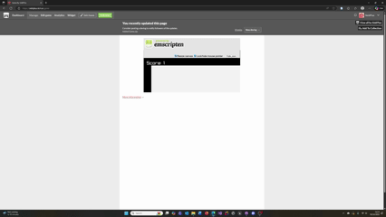

## How to compile with Emscripten (emcc)?

To compile a program with Emscripten (emcc), first ensure that Emscripten is installed and activated using source ./emsdk_env.sh in your terminal. Then, use the emcc command to compile your C or C++ source code into WebAssembly (.wasm) and accompanying JavaScript or HTML files. For example, running emcc main.cpp -o index.html compiles main.cpp into an HTML file that can be run in a web browser. You can also generate only JavaScript (-o output.js) or WebAssembly (-s WASM=1) outputs, and include optimization flags like -O2 or -O3 for performance. Emscripten provides additional options for linking libraries, setting the runtime environment (-s ENVIRONMENT=web), or exposing functions for JavaScript interaction. Once compiled, you can serve the generated files locally using emrun index.html or a simple HTTP server to test your program in a browser.

## How to serve and play in a browser (e.g., python3 -m http.server 8000)?

To serve and play your Emscripten-compiled project in a web browser, you need to run a local web server since browsers block direct file access for WebAssembly and JavaScript modules. One of the simplest methods is to use Python’s built-in HTTP server. Navigate to the directory containing your compiled files (e.g., index.html, .js, and .wasm), then open a terminal and run python3 -m http.server 8000. This command starts a local server on port 8000, which you can access by opening your web browser and visiting http://localhost:8000. Your Emscripten output page will load just like a regular website, allowing you to test and interact with your WebAssembly application directly in the browser environment.

## The source/API you used for the web request

The Random Word API is a simple, public web service that provides a list of random words upon request. By using a standard HTTP GET method and appending the query parameter ?number=3, your C++ application was able to specify that it wanted three words. The API responds with the requested words formatted as a JSON array. Your code then parsed this array to extract the words and used the count of these words to dynamically modify the enemy speed in your game, demonstrating how external, real-time data can be used to influence game parameters.

[Random Word Generator](https://random-word-api.herokuapp.com/word?number=3)

## Game

